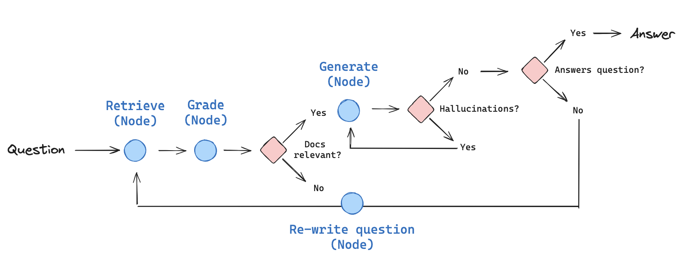

# Self-RAG Pipeline

This repository contains a self-Retrieval-Augmented Generation (self-RAG) pipeline built using Django REST API. The pipeline takes user input to process questions with relevant document context dynamically. It enables intelligent querying and retrieval over specified documents.



## Features

- **Self-RAG with Django**: Implements a self-RAG pipeline using Django REST API for ease of deployment and configuration.
- **Dynamic Input Format**: Accepts a flexible input format in JSON, allowing users to specify the `prompt` and document paths (`pdf_paths`) for retrieval-based question answering.
- **Configurable Settings**: Uses `config` to specify session-related information (e.g., `thread_id`), supporting session tracking for multi-threaded use cases.

## Input Format

The API expects input in the following JSON format:

```json
{
    "config": {
        "configurable": {
            "thread_id": id
        }
    },
    "prompt": "Your question or prompt here",
    "pdf_paths": [
        "filepath1",
        "filepath2"
    ]
}
```

- **`config`**: Contains configuration options. In this example, it includes `configurable` settings like `thread_id`.
- **`prompt`**: The question or command the user wants to query against the documents.
- **`pdf_paths`**: A list of file paths to the documents (in PDF format) where relevant information will be retrieved.

## Setup and Installation

1. **Clone the Repository**:
    ```bash
    git clone https://github.com/Chitresh-code/Self-RAG.git
    cd Self-RAG
    ```

2. **Install Dependencies**:
    Ensure you have Python installed, then install the required dependencies:
    ```bash
    pip install -r requirements.txt
    ```

3. **Run Django Migrations**:
    ```bash
    python manage.py migrate
    ```

4. **Start the Django Server**:
    ```bash
    python manage.py runserver
    ```

## Usage

1. Send a `POST` request to the API endpoint with the specified JSON format in the body.
2. The API will return responses based on the provided prompt and PDF documents.

### Example Request in Postman

1. Open Postman and create a new **POST** request.
2. Set the **URL** to:
   ```
   http://127.0.0.1:8000/api/ask/
   ```
3. Under the **Headers** tab, add the following header:
   - **Key**: `Content-Type`
   - **Value**: `application/json`
4. Go to the **Body** tab, select **raw**, and choose **JSON** from the dropdown.
5. Enter the JSON payload:

   ```json
   {
       "config": {
           "configurable": {
               "thread_id": "1"
           }
       },
       "prompt": "What are the key points in document?",
       "pdf_paths": [
           "path/to/document1.pdf",
           "path/to/document2.pdf"
       ]
   }
   ```

6. Click **Send** to execute the request.

---

This will send a request to your Django REST API, with Postman handling the JSON data and headers automatically.

## Contributing

Contributions are welcome! Please fork this repository and submit a pull request.
